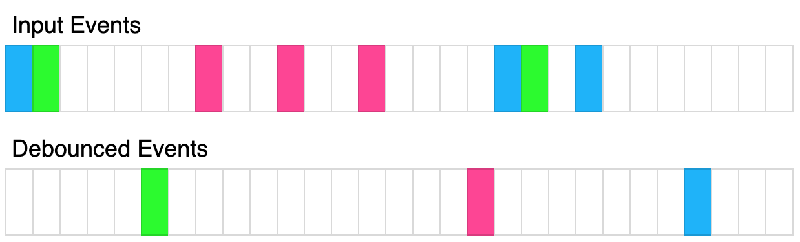

### [&#8592; Back to other problems](../../README.md)

## 2627. [Debounce](https://leetcode.com/problems/debounce/)

Write a function that accepts another function and a time in milliseconds `t` and returns a *
*debounced**
version of that function.

A **debounced** function is a function whose execution is delayed by `t` milliseconds and whose
execution
is cancelled if it is called again within that window of time. The debounced function should also
recieve the passed parameters.

For example, let's say `t = 50ms`, and the function was called at `30ms`, `60ms`, and `100ms`. The
first 2
function calls would be cancelled, and the 3rd function call would be executed at `150ms`. If
instead
`t = 35ms`, The 1st call would be cancelled, the 2nd would be executed at `95ms`, and the 3rd would
be
executed at `135ms`.

The above diagram shows how debounce will transform events. Each rectangle represents 100ms and the
debounce time is 400ms. Each color represents a different set of inputs.

Please solve it without using lodash's `_.debounce()` function.

##### Examples

**Example 1:**

<pre>
<b>Input:</b>
t = 50
calls = [
  {"t": 50, inputs: [1]},
  {"t": 75, inputs: [2]}
]
<b>Output:</b> [{"t": 125, inputs: [2]}]
<b>Explanation:</b>
let start = Date.now();
function log(...inputs) { 
  console.log([Date.now() - start, inputs ])
}
const dlog = debounce(log, 50);
setTimeout(() => dlog(1), 50);
setTimeout(() => dlog(2), 75);

The 1st call is cancelled by the 2nd call because the 2nd call occurred before 100ms
The 2nd call is delayed by 50ms and executed at 125ms. The inputs were (2).
</pre>

**Example 2:**

<pre>
<b>Input:</b>
t = 20
calls = [
  {"t": 50, inputs: [1]},
  {"t": 100, inputs: [2]}
<b>Output:</b> [{"t": 70, inputs: [1]}, {"t": 120, inputs: [2]}]
<b>Explanation:</b>
The 1st call is delayed until 70ms. The inputs were (1).
The 2nd call is delayed until 120ms. The inputs were (2).
</pre>

**Example 3:**

<pre>
<b>Input:</b>
t = 150
calls = [
  {"t": 50, inputs: [1, 2]},
  {"t": 300, inputs: [3, 4]},
  {"t": 300, inputs: [5, 6]}
]
<b>Output:</b> [{"t": 200, inputs: [1,2]}, {"t": 450, inputs: [5, 6]}]
<b>Explanation:</b>
The 1st call is delayed by 150ms and ran at 200ms. The inputs were (1, 2).
The 2nd call is cancelled by the 3rd call
The 3rd call is delayed by 150ms and ran at 450ms. The inputs were (5, 6).
</pre>

##### Constraints

* <code>0 <= t <= 1000</code>
* <code>1 <= calls.length <= 10</code>
* <code>0 <= calls[i].t <= 1000</code>
* <code>0 <= calls[i].inputs.length <= 10</code>
